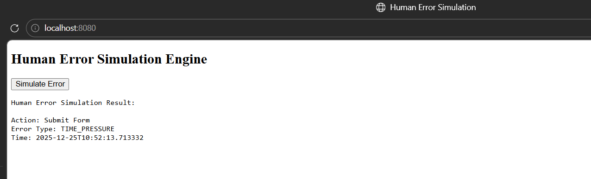
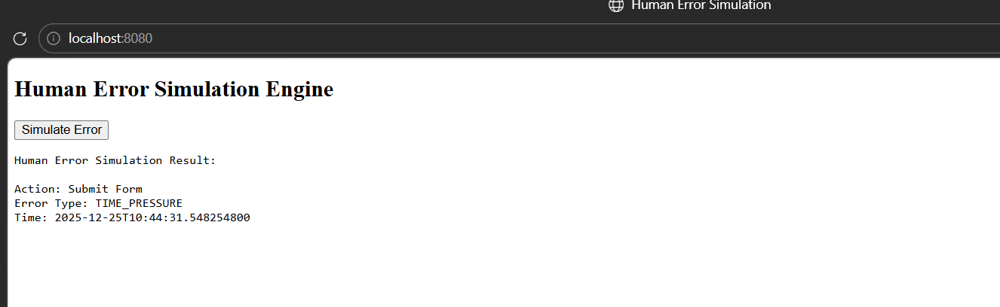

# 🚨 Human Error Simulation Engine (Java + MySQL)

## 📌 Project Overview
**Human Error Simulation Engine** is a Java-based backend project that simulates common human errors during user actions and stores those events permanently in a MySQL database.

This project demonstrates **core Java concepts, backend logic, SQL usage, and database integration** without using any heavy frameworks.

> In simple words:  
> **User action → Java logic → Error simulation → Data stored in MySQL**

---

## 🎯 Why This Project?
Most beginner projects only show UI or CRUD operations.  
This project focuses on **logic, backend flow, and real-world data storage**, which is very important for fresher backend / Java roles.

---

## 🧠 What Problem Does It Solve?
In real systems, human errors occur due to:
- Time pressure
- Lack of knowledge
- Misclicks
- Manual mistakes  

This system simulates such errors and stores them for **analysis, learning, and future improvement**.

---

## ⚙️ How the Project Works (Flow)

1. User opens the application in the browser (`localhost`)
2. Clicks on **Simulate Error**
3. Java backend:
   - Simulates a human error
   - Generates error details
4. Data is:
   - Displayed in browser
   - Stored permanently in **MySQL database**

---

## 🖥️ Output Example

Human Error Simulation Result:

Action: Submit Form
Error Type: TIME_PRESSURE
Time: 2025-12-25T10:44:21


---

## 🗄️ Database Storage (MySQL)

- **Database Name:** `human_error_db`
- **Table Name:** `error_event`

Each click stores a new record:

| id | action_name | error_type | event_time |
|----|------------|-----------|-----------|
| 1  | Submit Form | TIME_PRESSURE | 2025-12-25T10:44:21 |

👉 Data is **permanently stored**, not temporary.

---

## 🛠️ Technologies Used

### Backend
- Java (Core Java)
- Built-in Java HTTP Server
- JDBC (MySQL Connector/J)

### Frontend
- HTML
- JavaScript (Fetch API)

### Database
- MySQL
- SQL

---

## 📂 Project Structure

human-error-simulation-engine/
│
├── src/main/java/com/dhanraj/humanerror/
│ ├── app/ → Main application
│ ├── service/ → Business logic
│ ├── dao/ → Database access
│ ├── model/ → Data models
│ ├── config/ → DB configuration
│ └── util/ → Utility classes
│
├── web/
│ └── index.html → Browser UI
│
├── lib/
│ └── mysql-connector-j-8.3.0.jar
│
└── README.md


---

## ▶️ How to Run the Project

### 1️⃣ Start MySQL
Make sure MySQL server is running.

### 2️⃣ Compile the Project
```bash
javac -encoding UTF-8 -cp lib/mysql-connector-j-8.3.0.jar ^
src/main/java/com/dhanraj/humanerror/app/MainApp.java ^
src/main/java/com/dhanraj/humanerror/service/ErrorAnalysisService.java ^
src/main/java/com/dhanraj/humanerror/dao/ErrorEventDAO.java ^
src/main/java/com/dhanraj/humanerror/config/DBConfig.java ^
src/main/java/com/dhanraj/humanerror/model/*.java ^
src/main/java/com/dhanraj/humanerror/util/TimeUtil.java


3️⃣ Run the Application
java -cp "lib/mysql-connector-j-8.3.0.jar;src/main/java" com.dhanraj.humanerror.app.MainApp

4️⃣ Open Browser
http://localhost:8080


Click Simulate Error.

🔍 How to Verify Data in MySQL
USE human_error_db;
SELECT * FROM error_event;


Each click adds a new row.


Output Images

Microsoft Windows [Version 10.0.26200.7462]
(c) Microsoft Corporation. All rights reserved.

C:\Users\dhanr\OneDrive\Desktop\human-error-simulation-engine>mysql -u root -p

Enter password: ****
Welcome to the MySQL monitor.  Commands end with ; or \g.
Your MySQL connection id is 37
Server version: 8.0.44 MySQL Community Server - GPL

Copyright (c) 2000, 2025, Oracle and/or its affiliates.

Oracle is a registered trademark of Oracle Corporation and/or its
affiliates. Other names may be trademarks of their respective
owners.

Type 'help;' or '\h' for help. Type '\c' to clear the current input statement.

mysql> USE human_error_db;   # error shown
ERROR 1049 (42000): Unknown database 'human_error_db'
mysql> CREATE DATABASE human_error_db;
Query OK, 1 row affected (0.04 sec)

mysql> USE human_error_db;
Database changed
mysql> CREATE TABLE error_event (
    ->     id INT AUTO_INCREMENT PRIMARY KEY,
    ->     action_name VARCHAR(100),
    ->     error_type VARCHAR(50),
    ->     event_time VARCHAR(100)
    -> );
Query OK, 0 rows affected (0.06 sec)

mysql> SHOW DATABASES;
+--------------------+
| Database           |
+--------------------+
| human_error_db     |
| information_schema |
| mysql              |
| owner              |
| performance_schema |
| smart_lms          |
| sys                |
+--------------------+
7 rows in set (0.02 sec)

mysql> SELECT * FROM error_event;
+----+-------------+---------------+-------------------------------+
| id | action_name | error_type    | event_time               
     |
+----+-------------+---------------+-------------------------------+
|  1 | Submit Form | TIME_PRESSURE | 2025-12-25T10:44:21.836500800 |
|  2 | Submit Form | TIME_PRESSURE | 2025-12-25T10:44:23.064116800 |
|  3 | Submit Form | TIME_PRESSURE | 2025-12-25T10:44:24.274906400 |
|  4 | Submit Form | TIME_PRESSURE | 2025-12-25T10:44:25.165277100 |
|  5 | Submit Form | TIME_PRESSURE | 2025-12-25T10:44:25.915823500 |
|  6 | Submit Form | TIME_PRESSURE | 2025-12-25T10:44:27.718936900 |
|  7 | Submit Form | TIME_PRESSURE | 2025-12-25T10:44:28.387070500 |
|  8 | Submit Form | TIME_PRESSURE | 2025-12-25T10:44:28.934497900 |
|  9 | Submit Form | TIME_PRESSURE | 2025-12-25T10:44:29.478487500 |
| 10 | Submit Form | TIME_PRESSURE | 2025-12-25T10:44:30.051590    |
| 11 | Submit Form | TIME_PRESSURE | 2025-12-25T10:44:30.471610800 |
| 12 | Submit Form | TIME_PRESSURE | 2025-12-25T10:44:31.051078700 |
| 13 | Submit Form | TIME_PRESSURE | 2025-12-25T10:44:31.548254800 |
+----+-------------+---------------+-------------------------------+
13 rows in set (0.00 sec)

mysql>

Url shown





💡 Key Concepts Demonstrated

Core Java

Backend logic design

DAO pattern

JDBC + SQL

MySQL integration

HTTP server handling

End-to-end system flow

🎤 Interview Ready Explanation

“This project simulates human errors using Java backend logic, exposes functionality through a browser interface, and stores all events in a MySQL database using JDBC and SQL.”

🚀 Future Enhancements

Different error types based on conditions

Analytics dashboard

REST API expansion

Authentication

Reporting module

👨‍💻 Author

Dhanraj Rajendra Sonawane
MCA | Java Backend Enthusiast